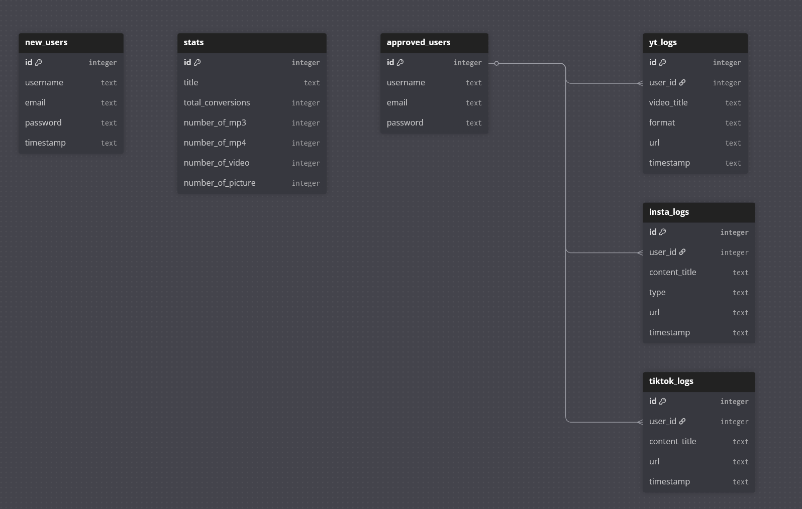

# API documentation for Media Converter

API requests are seperated in seperate sections based on their usage.

## Authentication
Several endpoints require authentication via **Bearer Token**.

### Authorization header
```
Authorization: Bearer <access_token>
```
Token is obtained via the `/api/login` endpoint.

## Server health check

### GET `/api/ping`
Checks if the backend server is available.

### Success response
```json
{
    "status": "ok",
    "message": "server is alive"
}
```

## User Authentication

### POST `/api/register`
Checks if the user already exists. In case the user is new it's stored in **new_users** table.

### Sample request
``` json
{
    "username": "test",
    "email": "test@test.com",
    "password": "test123"
}
```
### Success response
```json
{   
    "status": "success", 
    "message": "Registration successful."
}
```

### Error response
```json
{   
    "status": "error", 
    "message": "User already exists."
}
```

### POST `/api/login`
Authenticates user and returns JWT.

### Sample request
```json
{
    "username": "test",
    "password": "test123"
}
```

### Success response
```JSON
{
    "status": "success",
    "message": "Login successful!",
    "access_token": jwt_token,
    "token_type": "bearer",
}
```

### Error response
```json
{
    "status": "invalid",
    "message": "Username or password is incorrect!",
},
```
### GET `/api/user_info`
Validets user's token and returns the username.

### Success response

```json
{
    "status": "success", 
    "user": "test"
}
```

## Youtube API

### POST `/api/youtube/convert`
Downloads and converts a YouTube video to selected format.

**Authentication required**

### Sample request
```json
{
    "url": "https://www.youtube.com/watch?v=...",
    "format": "mp4",
    "resolution": "720p"
}
```

### Success response
```json
{
    "status": "success",
    "message": "Download complete",
    "filename": "video_title_ab12cd34.mp4"
}
```

### Error response
```JSON
{
    "status": "error", 
    "message": "Error message"
}
```

### POST `/api/youtube/download`
Downloads previously converted YouTube video to client's device.

### Sample request
```json
{
    "filename": "video_title_ab12cd34.mp4"
}
```

### Success response
Binary file response (application/octet-stream).

### Error response
```json
{
    "status": "error", 
    "message": "File not found!"
}
```
### DELETE `/api/youtube/delete`
Deletes downloaded YouTube video from the server.

### Sample request
```json
{
    "filename": "video_title_ab12cd34.mp4"
}
```

### Success response
```json
{
    "status": "deleted"
}
```

### Error response
```json
{
    "status": "not found"
}
```

## Instagram API

### POST ``/api/instagram/convert``
Downloads Instagram content (video or picture). \
Supports both single posts and carousel (sidecar) posts.

**Authentication required**

### Sample request
```json
{
  "url": "https://www.instagram.com/p/POST_ID/",
  "type": "video"
}
```

### Success response (single file)
```json
{
    "status": "success",
    "message": "download complete",
    "filename": "instagram_video_ab12cd34.mp4"
}
```

### Success reponse (multiple files)
```json
{
    "status": "success",
    "message": "download complete",
    "filename": "instagram_ab12cd34.zip"
}
```

### Error response
```json
{   
    "status": "error", 
    "message": "invalid content type"
}
```

### POST `/api/instagram/download`
Downloads converted Instagram content.

### Sample request
```JSON
{
    "filename": "instagram_ab12cd34.zip"
}
```

### Success response
Binary file response (`application/zip` or `application/octet-stream`)

### Error response
```json
{
    "status": "error", 
    "message": "File not found!"
}
```

### DELETE `/api/instagram/delete`
Deletes downloaded Instagram content.

### Sample request
```JSON
{
    "filename": "instagram_ab12cd34.zip"
}
```

### Success response
```JSON
{
    "status": "deleted"
}
```

### Error response
```JSON
{
    "status": "error", 
    "message": "not found"
}
```
## TikTok API

### POST `/api/tiktok/convert`
Downloads a TikTok video in MP4 format.

### Sample request
```JSON
{
  "url": "https://www.tiktok.com/@user/video/VIDEO_ID"
}
```

### Success response
```JSON
{
    "status": "success",
    "message": "Download complete",
    "filename": "tiktok_video_ab12cd34.mp4"
}
```

### Error response
```JSON
{
    "status": "error", 
    "message": "Error message."
}
```

### POST `/api/tiktok/download`
Downloads converted TikTok video.

### Sample request
```JSON
{
    "filename": "tiktok_video_ab12cd34.mp4"
}
```

### Success response
Binary file response (`application/octet-stream`)

### Error response
```JSON
{
    "status": "error", 
    "message": "File not found!"
}
```

### DELETE `/api/tiktok/delete`
Deletes downloaded TikTok video.

### Sample request
```JSON
{
    "filename": "tiktok_video_ab12cd34.mp4"
}
```

### Success response
```JSON
{
    "status": "deleted"
}
```

### Error response
```JSON
{
    "status": "error", 
    "message": "File not found"
}
```

## Log & Statistics

### POST `/api/logs`
Downloads user specific conversion logs as a text file.

**Authentication required**

### Sample request
```JSON
{
    "table": "youtube"
}
```
Allowed values:
- youtube
- instagram
- tiktok
  
### Success response
Text file download (`text/plain`).

### Error response
```JSON
{
    "status": "error", 
    "message": "unknown table"
}
```

### POST `/api/stats`
Returns global site usage stats. 

### Sample request
```JSON
{
    "table": "youtube"
}
```

Allowed values:
- youtube
- instagram
- tiktok

### Success response
```JSON
{
    "status": "success",
    "total_conversions": 120,
    "number_of_mp3": 40,
    "number_of_mp4": 80,
}
```

### Error response
```JSON
{
    "status": "error", 
    "message": "Error message"
}
```

## Background Processes
- A background garbage collector thread periodically deletes downloaded files that have not been accessed for more than 30 minutes.
- Database write operations are executed in a thread pool to avoid blocking the async event loop.


## Data model



